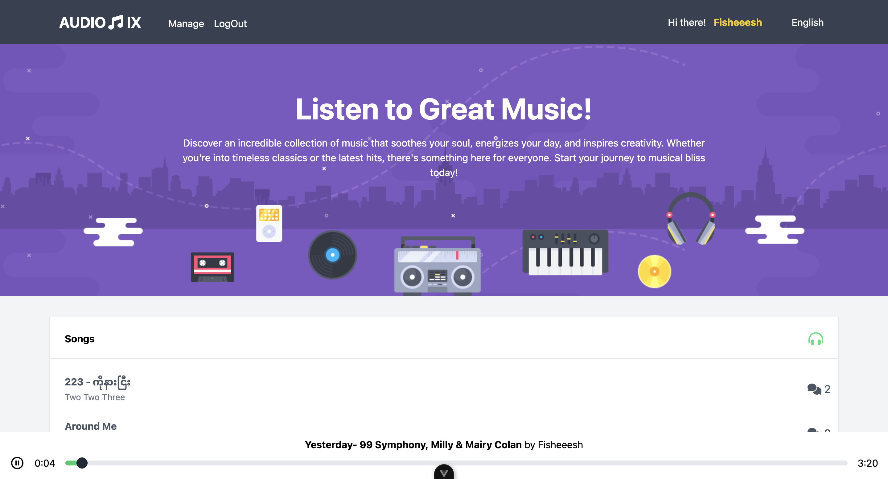

# Audionix 🎵

Audionix is a modern music application where users, artists, and producers can enjoy and manage music in a seamless experience. Whether you’re a listener or a creator, Audionix offers intuitive tools to explore, upload, and manage your music. Built with Vue 3, Firebase, Pinia, and Tailwind CSS, this single-page application (SPA) ensures smooth interactions, an elegant design, and secure features for everyone.



## Table of Contents
- [Features](#features)
  - [General Features](#general-features)
  - [Authenticated Features](#authenticated-features)
  - [Security](#security)
  - [Design](#design)
- [Tools and Technologies](#tools-and-technologies)
- [Preview](#preview)
- [Recommended IDE Setup](#recommended-ide-setup)
- [Customize Configuration](#customize-configuration)
- [Project Setup](#project-setup)
- [License](#license)

## Features

### General Features
- **Listen to Music**: Browse and play songs with a responsive progress bar allowing you to jump to any part of a song.
- **Infinite Scroll**: Displays an initial set of 10 songs and fetches more as you scroll down the homepage.
- **Smooth Transitions**: Enjoy smooth animations while navigating between routes and components.
- **Multilingual Support**: Switch between English and Burmese with Vue-i18n for a localized experience.

### Authenticated Features
- **Login/Registration**: Secure authentication using Firebase Auth.
- **Music Management**: Upload, update, and delete your own songs with support for fallback and dropdown upload. Multiple uploads are allowed.
- **Comment System**: Leave comments on songs you like, with timestamps formatted using Date-fns. Manage (delete) only your own comments.
- **Access Control**: Only authenticated users can upload, manage, or comment on songs.

### Security
- **Route Guards**: Prevent unauthorized access to restricted pages and features.
- **User Permissions**: Users can manage only their uploaded content, ensuring privacy and security.

### Design
- **Responsive Design**: Built with Tailwind CSS for a sleek, modern, and mobile-friendly interface.
- **UX Enhancements**: Smooth animations and transitions for better user experience.

## Tools and Technologies
- **Frontend**: Vue 3 with Vite.
- **State Management**: Pinia for efficient and reactive state handling.
- **Form Validation**: Vee-Validate for robust and user-friendly form handling.
- **Audio Playback**: Howler.js for seamless music playback.
- **Localization**: Vue-i18n for internationalization (English and Burmese).
- **Date Formatting**: Date-fns to display human-readable timestamps for comments.
- **Backend**: Firebase (Firestore for data, Firebase Storage for songs, and Firebase Auth for authentication).
- **Styling**: Tailwind CSS for responsive and elegant design.

 ## Preview
 Live Demo - https://music-b055.web.app

## Recommended IDE Setup

[VSCode](https://code.visualstudio.com/) + [Volar](https://marketplace.visualstudio.com/items?itemName=Vue.volar) (and disable Vetur).

## Customize configuration

See [Vite Configuration Reference](https://vite.dev/config/).

## Project Setup

```sh
npm install
```

### Compile and Hot-Reload for Development

```sh
npm run dev
```

### Compile and Minify for Production

```sh
npm run build
```

### Run Unit Tests with [Vitest](https://vitest.dev/)

```sh
npm run test:unit
```

### Run End-to-End Tests with [Cypress](https://www.cypress.io/)

```sh
npm run test:e2e:dev
```

This runs the end-to-end tests against the Vite development server.
It is much faster than the production build.

But it's still recommended to test the production build with `test:e2e` before deploying (e.g. in CI environments):

```sh
npm run build
npm run test:e2e
```

### Lint with [ESLint](https://eslint.org/)

```sh
npm run lint
```

## License

This project is licensed under the **MIT License**.  

[](https://opensource.org/licenses/MIT)  

You can view the full license [here](LICENSE).
